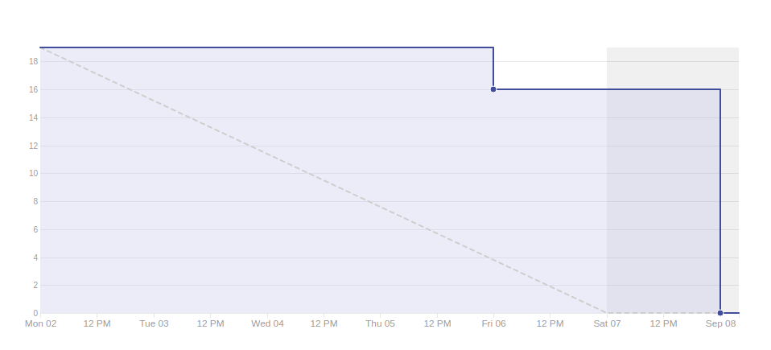
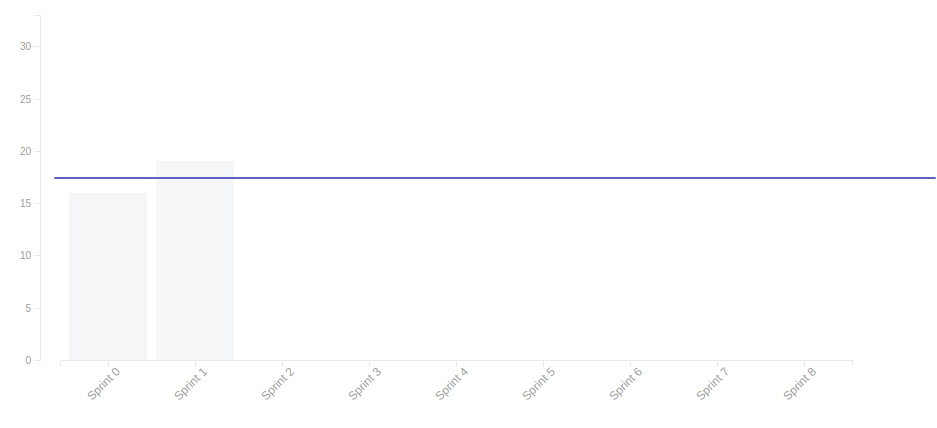
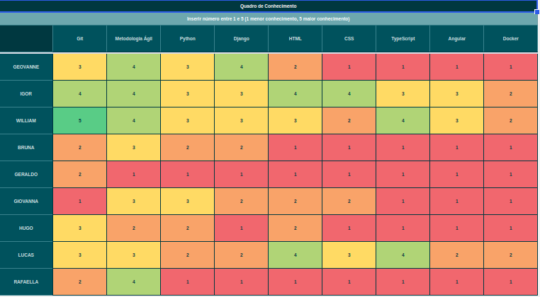

# Resultado Sprint 1

## Sprint Backlog

### Pontuação da Sprint

**Pontos planejados:** 21 pontos  
**Pontos concluídos:** 19 pontos  
**Dívidas geradas:** 2 pontos  

### Issues Entregues

- [#10 Criar Documento de Visão](https://github.com/fga-eps-mds/2019.2-Grupo7/issues/10) - 3 pontos
- [#12 Criar Documento de Metodologia](https://github.com/fga-eps-mds/2019.2-Grupo7/issues/12) - 1 ponto
- [#13 Documentar Sprint 1](https://github.com/fga-eps-mds/2019.2-Grupo7/issues/13) - 2 pontos
- [#14 Dojo: Documentação](https://github.com/fga-eps-mds/2019.2-Grupo7/issues/14) - 3 pontos
- [#15 Iniciar projetos](https://github.com/fga-eps-mds/2019.2-Grupo7/issues/15) - 2 pontos
- [#17 Criar Mapa Mental](https://github.com/fga-eps-mds/2019.2-Grupo7/issues/17) - 2 pontos
- [#18 Criar Protótipo de Baixa Fidelidade](https://github.com/fga-eps-mds/2019.2-Grupo7/issues/18) - 3 pontos
- [#19 Estudar tecnologias](https://github.com/fga-eps-mds/2019.2-Grupo7/issues/19) - 3 pontos

### Dívidas Técnicas

- [#16 Criar Termo de Abertura de Projeto (TAP)](https://github.com/fga-eps-mds/2019.2-Grupo7/issues/16) - 2 pontos

## Retrospectiva da Sprint

### Pontos Positivos

- Melhoria na comunicação e entrosamento entre a equipe
- Definição das tecnologias que serão usadas no projeto, inclusive a arquitetura
- Os desenvolvedores (equipe MDS) já estão estudando as linguagens
- A visão do escopo ficou mais robusta, com o documento de visão e protótipo de baixa fidelidade

### Pontos Negativos

- Issues sendo fechadas na data errada
- Demora na entrega do planejamento da sprint 1

### Sugestão de melhoria

- Equipe MDS olhar repositórios de trabalhos anteriores, para se familiarizarem com as documentações.
- Melhorar gerenciamento das issues

## Burndown

Percebe-se que pela falta de administração no fechamento das issues no tempo certo, afetou o gráfico burndown, mesmo que as issues estivessem sendo feitas progressivamente durante a semana, duas issues ficaram sem ser resolvidas e viraram débito técnico, muito devido essa sprint 1 também ser atípica, pelo fato de estarmos decidindo arquitetura e linguagens.

## Velocity

O velocity mostra que o número de pontos concluídos aumentou, mesmo com havendo o atraso de uma issue e com a adição de issues mais elaboradas e direcionadas para o escopo do projeto.

## Quadro de Conhecimento

Este quadro aborda o conhecimento depois de 2 semanas de projeto, ou duas sprints, houve um considerável aumento dessa tabela, pois com as tecnologias e arquitetura decididas o quadro teve de ser atualizado, inicialmente a maioria dos espaços estão em vermelho, mas a tendência é o conhecimento se nivelar e aumentar progressivamente, com os dojos e estudos individuais.

## Análise do Scrum Master

Esta Sprint teve como objetivo decidirmos a tecnologia e arquitetura que será utilizada, além de validarmos os requisitos do projeto com possíveis usuários, a equipe com uma reunião elaborou o primeiro protótipo e mapa mental, o que fez com que todos os membros da equipe tivessem já a noção do que seria criado, e isso foi exercitado com o desenvolvimento do documento de visão. Na questão de conhecimento, todos começaram os estudos individuais. Esta Sprint foi bem difícil, porque exigiu um planejamento bem pensado e demorado, pelas decisões de projeto que tivemos que tomar.
