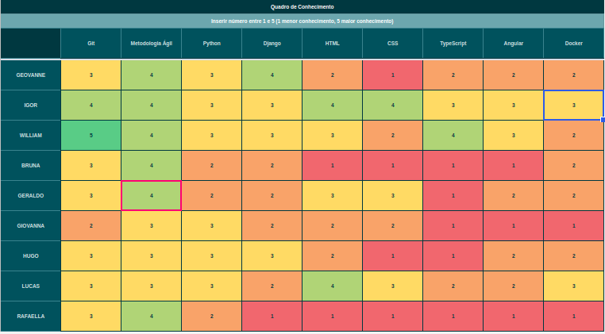
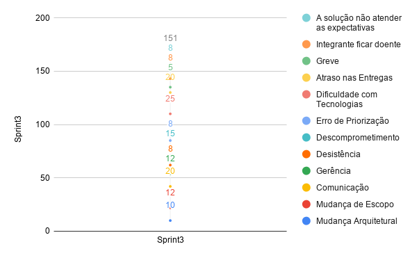

# Fechamento da Sprint 3

## 1- Resumo da Sprint
**Membros Presentes:** Geovanne, Lucas, Geraldo, Bruna e Rafaella.

##### Pontos concluídos: 23 pontos

- Histórias Entregues:

- [#42 Criar Documento de Arquitetura](https://github.com/fga-eps-mds/2019.2-FoodCare/issues/42)

- [#44 Criar Backlog do Produto](https://github.com/fga-eps-mds/2019.2-FoodCare/issues/44)

- [#45 Criar Pipeline de Deploy Contínuo](https://github.com/fga-eps-mds/2019.2-FoodCare/issues/45)

- [#46 Criar Plano de Gerenciamento de Riscos](https://github.com/fga-eps-mds/2019.2-FoodCare/issues/46)

- [#47 Criar Documento de Ferramentas](https://github.com/fga-eps-mds/2019.2-FoodCare/issues/47)

- Histórias Não Entregues:

- [#40 Criar Home](https://github.com/fga-eps-mds/2019.2-FoodCare/issues/40)

- [#41 Criar Cadastro e Login de Doador](https://github.com/fga-eps-mds/2019.2-FoodCare/issues/41)

- [#43 Criar Termo de Compromisso](https://github.com/fga-eps-mds/2019.2-FoodCare/issues/43)

Pode-se se observar que o número de issues programadas foram bem mais que em sprints passadas, fazendo com que uma issue de EPS  e duas issues de MDS atrasassem. O documento de arquitetura, o mais complexo e mais difícil de elaborar, também levou bastante tempo da equipe de desenvolvimento para ser finalizado.

## 2- Retrospectiva da sprint
|**Pontos Positivos**|**Pontos Negativos**|**Sugestão de melhoria**|
|---|---|---|
|As documentações de mds foram finalizadas|Equipe de MDS teve muita dificuldade para rodar o Docker|sempre q mds for programar, que seja pelo pareamento, para compartilhar conhecimento|
|A equipe está se esforçando para aprender a tecnologia|requisitos funcionais viraram dívida técnica|Tentar resolver as issues de código desde o primeiro dia da sprint |
|O review foi bastante interessante, deu para perceber a dificuldade que cada mds estava tendo|Equipe de mds ainda tem algumas dúvidas em relação a arquitetura|---|
|---|O pareamento aconteceu poucas vezes, pois eles acabaram tentando fazer sua parte sozinha|---|

## 3- Quadro de conhecimento

Este quadro aborda o conhecimento depois de quatro sprints, vemos que todos já sabem a metodologia, a parte de backend o desenvolvimento está em crescimento, o maior problema são com as tecnologias relacionadas ao Angular, onde a maioria dos membros tem dificuldade, e isso faz com que ao final da sprint as issues funcionem em partes, mas o todo não é entregue, [tabela de horas trabalhadas](https://docs.google.com/spreadsheets/d/1NrR6Oh-tJsaAimDdOja_gvTsL-g2F_3fklMY8SX_2AQ/edit#gid=1662865666), por esta tabela dá para perceber que a equipe de MDS que pegou a issue de home, que foram Rafaella, Geraldo e Lucas, tiveram algumas horas com foco no Angular, houve umas disseminação de conhecimento, inclusive pela descrição das horas trabalhadas deu para perceber isso.

## 4- Burndown

Foram 41 pontos planejados, onde desses 41, foram entregues 23. Mesmo com alguns tutoriais para fixar o aprendizado e  supervisão dos EPS, houve muitas dúvidas na hora de programar, essa foi a primeira Sprint com código, no qual eles tiveram que parear e mexer tanto na API quanto no Angular, para montagem das telas, a falta do costume de programar todos dias também interferiu para que todas as issues fossem entregues, e que não surgissem dívidas técnicas, em relação a documentação, a produção foi regular e não houve muitos problemas.

## 5- Velocity

Apesar do planejamento ter aumentado o número de pontos da Sprint 2 para a Sprint 3, o número entregue foi menos, ocorrendo uma queda no Velocity, agora antes de planejarmos uma Sprint com um número maior de pontos, e com issues mais difíceis, temos que ter certeza de que a equipe de MDS tem base técnica para a solução de tais funções. Assim podemos chegar num Velocity saudável e mantenha as entregas bem regulares e padronizadas.

## 6- Burndown de Risco

Esse tópico faz com que possamos analisar todos os possíveis riscos de cada Sprint, e ver como esses riscos se comportam conforme as Sprints vão passando, vendo se as ações para diminuir os pontos por riscos e a maturidade da equipe criam uma queda progressiva das linhas do gráfico. Nesse primeiro gráfico, os maiores riscos são a dificuldade da equipe de MDS com as tecnologias(Docker, Django Rest e Angular), a comunicação entre os membros, que é extremamente necessário para o pareamento ser um sucesso, e atraso nas entregas, por essa ser a primeira Sprint no qual MDS irá usar os conhecimentos dos DOJOS e estudos individuais para desenvolver os requisitos funcionais.

## Análise do Scrum Master

Essa Sprint tem como objetivo principal o fechamento do documento de arquitetura, e analisarmos como MDS se comportará em relação aos pareamentos, para que possamos rastrear as possíveis dificuldades, que podem ser que perdurem no futuro, a priorização dos requisitos funcionais foram baseados em issues de menos complexidade, na qual se acha bastante tutorial e material na internet, mas como esperado, mesmo com suporte a dificuldade no desenvolvimento foi grande, e o pareamento dos trios não foram executados todos os dias, devido a outras matérias que os MDS estão pegando ou por horário mesmo, mas vendo o quadro de horas e o de conhecimento, parece que o conhecimento de alguns foi disseminado para outros, e o grupo está mais preparado para a Sprint 4, para lidar com as issues.
