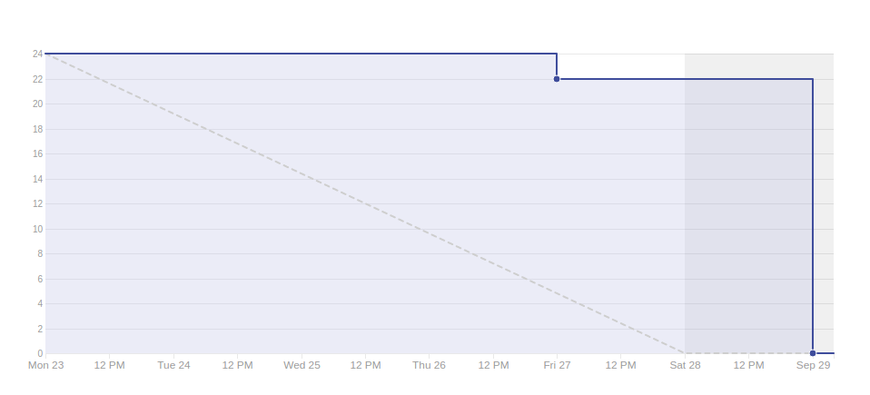
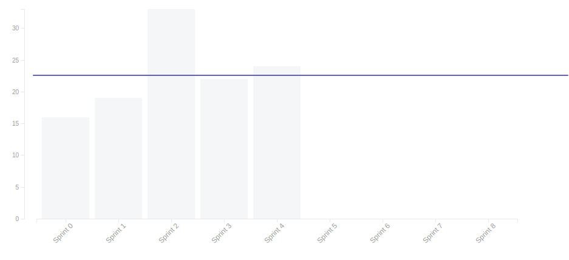
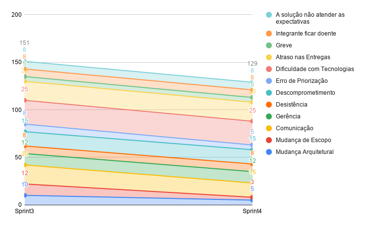

# Resultado Sprint 4

## Sprint Backlog

### Pontuação da Sprint

**Pontos planejados:** 40 pontos  
**Pontos concluídos:** 24 pontos  
**Dívidas geradas:** 26 pontos  

### Issues Entregues

- [#40 Criar Home](https://github.com/fga-eps-mds/2019.2-Grupo7/issues/40) - 8 pontos
- [#43 Criar Termo de Compromisso](https://github.com/fga-eps-mds/2019.2-Grupo7/issues/43) - 2 pontos
- [#52 Documentar Sprint 4](https://github.com/fga-eps-mds/2019.2-Grupo7/issues/52) - 2 pontos
- [#53 Refatorar documentos](https://github.com/fga-eps-mds/2019.2-Grupo7/issues/53) - 3 pontos
- [#54 Criar Plano de Gerenciamento de Qualidade](https://github.com/fga-eps-mds/2019.2-Grupo7/issues/54) - 2 pontos
- [#55 Criar Código de Conduta](https://github.com/fga-eps-mds/2019.2-Grupo7/issues/55) - 2 pontos
- [#56 Criar Guia de Contribuição](https://github.com/fga-eps-mds/2019.2-Grupo7/issues/56) - 2 pontos
- [#57 Criar Especificação Suplementar](https://github.com/fga-eps-mds/2019.2-Grupo7/issues/57) - 3 pontos

### Dividas técnicas

- [#41 Criar Cadastro e Login de Doador](https://github.com/fga-eps-mds/2019.2-Grupo7/issues/41) - 8 pontos
- [#51 Gerenciamento de eventos](https://github.com/fga-eps-mds/2019.2-Grupo7/issues/51) - 8 pontos

## Retrospectiva da Sprint

### Pontos Positivos

- A equipe se empenhou para entregar os requisitos funcionais
- A equipe de mds começou a realizar o pareamento da maneira certa, programando juntos
- Em relação aos problemas do código, deu pra perceber onde estava o erro e deu para pensar numa solução para o erro que será executado na próxima sprint.
- Equipe de mds está com cada vez menos problemas com Docker

### Pontos Negativos

- Dificuldade em conectar a request do Angular com o que a API tem de receber
- Requisitos funcionais viraram dívida técnica
- Equipe de mds ainda tem algumas dúvidas em relação a arquitetura

### Sugestão de melhoria

- Tentar resolver as issues de código desde o primeiro dia da sprint
- Fazer mais encontros presenciais para tentar solucionar os erros dos requisitos funcionais
- Melhorar comunicação na hora de desenvolver as models, para que ela esteja modelada da melhor maneira

## Burndown

Foram 40 pontos planejados, onde desses 40, foram entregues 24. Mesmo com alguns tutoriais para fixar o aprendizado e supervisão dos EPS, houveram muitas dúvidas na hora de programar (principalmente na hora de conseguir integrar o front com a api), essa foi a segunda Sprint com código, no qual eles tiveram que parear e mexer tanto na API quanto no Angular, dessa vez um requisito funcional foi entregue.

## Velocity

Dessa vez decidimos manter o número de pontos planejados, e não aumentar mais os pontos para essa Sprint, devido as dívidas técnicas que poderiam dar trabalho, o Velocity se manteve regular, estamos cada vez mais chegando a um padrão saudável de produtividade, apesar que com a experiência maior da equipe os requisitos funcionais devem ser entregues com maior velocidade.

## Quadro de Conhecimento

Este quadro aborda o conhecimento depois de cinco sprints, vemos que todos já sabem a metodologia, a parte de backend o desenvolvimento está em crescimento, o maior problema são com as tecnologias relacionadas ao Angular, onde a maioria dos membros tem dificuldade, nessa como os pareamentos foram feitos mais vezes, e as issues envolvem tanto a api quanto o front, o conhecimento dos membros aumentaram, e isso faz com que nas próximas sprints toda a funcionalidade seja entregue, e não só um parte dela, pelas horas trabalhadas percebe-se que algumas pessoas que estavam com foco no backend sprint passada, nessa sprint teve de focar no Angular devido a nova distribuição de atividades, fazendo com que o time fique cada vez mais full stack.

<!-- ## Burndown de Risco

Esse tópico faz com que possamos analisar todos os possíveis riscos de cada Sprint, e ver como esses riscos se comportam conforme as Sprints vão passando, os riscos diminuíram em relação a arquitetura, decisões de priorização e comunicação, mas dificuldade com tecnologia continua sendo o maior risco, as ações de aumento de pareamento, mais tutoriais e supervisão dos eps estão começando a surgir efeito e esse risco tende a cair daqui umas 2-3 Sprints. -->

## Análise do Scrum Master

Essa Sprint teve como objetivo principal focar nas dívidas técnicas, ver como as novas duplas de pareamento se comportam, como o quadro de conhecimento está evoluindo, pois agora o time de mds está cada vez mais focado nos requisitos funcionais, a parte de documentação foi refatorada em alguns tópicos, só que mais uma revisão será feita antes da release 1.  
A review da Sprint deu para identificar que mds está com dificuldade em integrar os dados do front com o que api recebe, logo soluções serão propostas para a sprint 5.
