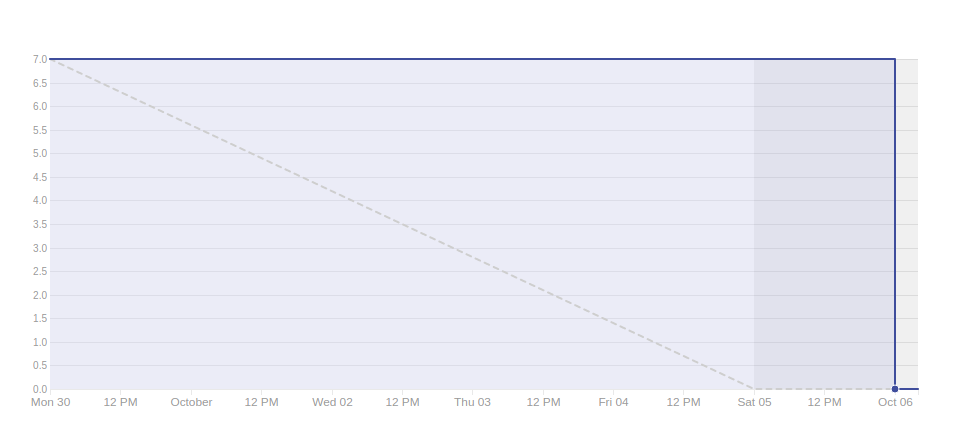
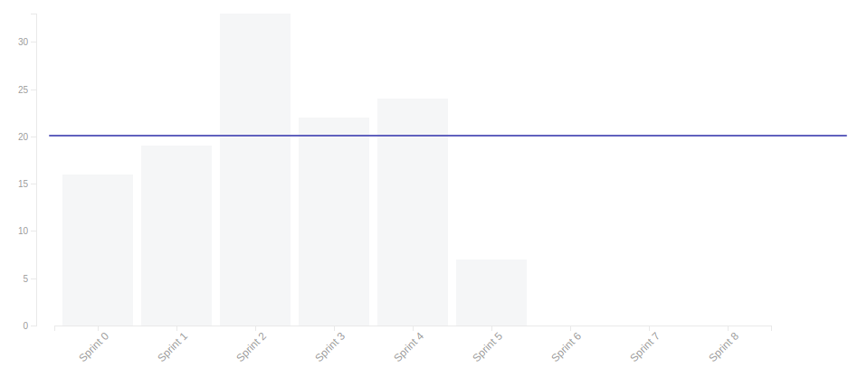
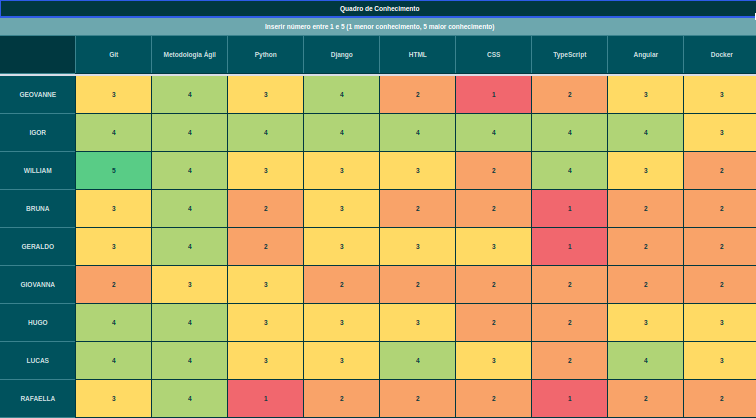

# Resultado Sprint 5

## Sprint Backlog

### Pontuação da Sprint

**Pontos planejados:** 31 pontos  
**Pontos concluídos:** 7 pontos  
**Dívidas geradas:** 24 pontos  

### Issues Entregues

- [#58 Documentar Sprint 5](https://github.com/fga-eps-mds/2019.2-Grupo7/issues/58) - 2 pontos
- [#59 Montar apresentação da R1](https://github.com/fga-eps-mds/2019.2-Grupo7/issues/59) - 2 pontos
- [#60 Refatorar GitHub Pages](https://github.com/fga-eps-mds/2019.2-Grupo7/issues/60) - 3 pontos

### Dividas técnicas

- [#41 Criar Cadastro e Login de Doador](https://github.com/fga-eps-mds/2019.2-Grupo7/issues/41) - 8 pontos
- [#51 Gerenciamento de eventos](https://github.com/fga-eps-mds/2019.2-Grupo7/issues/51) - 8 pontos
- [#61 Criar Formulário de Contato](https://github.com/fga-eps-mds/2019.2-Grupo7/issues/61) - 5 pontos
- [#63 Elaborar EVM](https://github.com/fga-eps-mds/2019.2-Grupo7/issues/63) - 3 pontos

## Retrospectiva da Sprint

### Pontos Positivos

- A equipe está estudando e vendo as sugestões de soluções que eps dá nas issues de RF

### Pontos Negativos

- Dificuldade em conectar a request do Angular com o que a API tem de receber
- Requisitos funcionais viraram dívida técnica
- Dificuldade em passar os PR no Travis
- Falta de comunicação de MDS, no quesito dúvidas no código, o que gerou baixa produtividade por essas dúvidas não terem sido colocadas com antecedência.

### Sugestão de melhoria

- Tentar resolver as issues de código desde o primeiro dia da sprint
- Fazer mais encontros presenciais para tentar solucionar os erros dos requisitos funcionais

## Burndown

Foram 31 pontos planejados, onde desses 31, foram entregues 7. Mesmo com alguns tutoriais para fixar o aprendizado e supervisão dos EPS, houveram muitas dúvidas na hora de programar (principalmente na hora de passar os pull request pelo Travis), essa foi a terceira Sprint com código, a comunicação terá que ser feita de forma mais constante, mesmo que não haja dúvidas, a supervisão ocorrerá, para evitar que dúvidas de mds sejam acumuladas e que se tornem conhecidas somente no final da Sprint, e as dailys serão bem mais detalhadas.

## Velocity

Novamente não aumentamos o número de pontos planejados, devido as dívidas técnicas que poderiam dar trabalho, o Velocity deu uma caída considerável, pois estamos indo pro segundo processo de entregas, que é o de código e a equipe está ainda ficando  madura na tecnologia.

## Quadro de Conhecimento

Este quadro aborda o conhecimento depois de seis sprints, podemos observar um conhecimento médio da equipe de mds na parte do Angular, a api o conhecimento vem se espalhando pelos pareamentos, assim que todos os quadros mais para a direita estejam amarelos e verdes como os da esquerda, as dívidas técnicas irão se tornar cada vez menos frequentes e terá uma entrega contínua de funcionalidades.

<!-- ## 6- Burndown de Risco

Esse tópico faz com que possamos analisar todos os possíveis riscos de cada Sprint, e ver como esses riscos se comportam conforme as Sprints vão passando, houve um aumento total dos riscos, pois por conselho da professora o escopo foi modificado, ou seja, foi reduzido, a risco da comunicação aumentou, devido as dificuldades de mds serem conhecidas somente no final da Sprint, e os outros tópicos se mantiveram como antes. -->

## Análise do Scrum Master

Essa Sprint teve como objetivo tentar terminar as dívidas técnicas e montar a apresentação da R1. Lições foram aprendidas, e isso vai nos ajudar a gerenciar melhor a Sprint 6, que será praticamente de código para mds, um outro fator será controlar as horas de trabalho, principalmente no tópico pareamento, para que possamos garantir que o conhecimento e a produção está sendo compartilhada.
